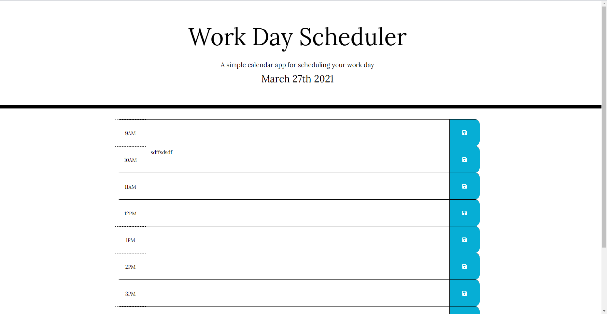

# work-day-scheduler

# descriptions
First started off with date and aligning elements in jumbotron was successful in setting it. Then tried to create a container to put time, input form, and save button. Jquery didn't seem to work so had to just use js. 

# screenshot

## Deployed Site
[Deployed Site](https://github.com/greenkimparsons/work-day-scheduler.)
